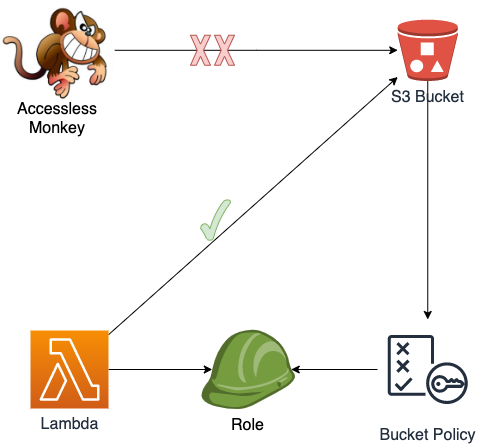

# Restrict Amazon S3 Bucket Access to a specific application using Roles and Serverless Framework

### What is this?
A serverless application that demonstrates how to restrict an S3 bucket access to a specific application and deny everything else

### The Architecture

* An S3 bucket restrict access to a specific role
* A lambda function with the correct role assigned have access to the bucket information
* A monkey(lambda function) with the wrong role can't access the bucket information

### Tech Stack
* [Serverless Framework](https://www.serverless.com/)
* [AWS Lambda](https://aws.amazon.com/lambda/)
* [Amazon S3](https://aws.amazon.com/s3/)
* [Python](https://www.python.org/)

### Prerequisite
* [Serverless framework](https://www.serverless.com/framework/docs/providers/aws/guide/installation/)
* [Python](https://wiki.python.org/moin/BeginnersGuide/Download)

### How to deploy it
```
sls deploy
```

### How to remove it
```
sls remove
```

### Author: Raisel Melian
* [Twitter](https://twitter.com/raiselmelian)