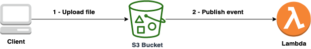

# S3 upload trigger lambda function

### What is this?
A serverless application that demonstrates how to trigger a lambda function after a file is uploaded into an S3 bucket. Two versions of the application are provided. One using the [Serverless Framework](https://www.serverless.com/) and the other using [AWS CDK](https://aws.amazon.com/cdk/) 

### The Architecture

* A client is a person or system who uploads files to an S3 bucket
* An S3 bucket publishes events after files are uploaded
* A lambda function invoked with context information about the S3 bucket and file metadata
* There are two versions of the same application. One using the [Serverless Framework](https://www.serverless.com/) and the other using [AWS CDK](https://aws.amazon.com/cdk/) 

### Versions
* [Serverless Framework](serverless-python/README.md)
* [AWS CDK](cdk-typescript/README.md)

### Author: Raisel Melian
* [Twitter](https://twitter.com/raiselmelian)