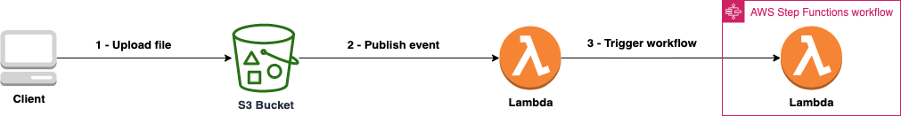

# Trigger a step function after file uploaded to an S3 bucket

### What is this?
A serverless application that demonstrates how to trigger a step function after a file is uploaded into an S3 bucket.

### The Architecture

* A client is a person or system who uploads files to an S3 bucket
* An S3 bucket publishes events after files are uploaded
* A lambda function is invoked with context information about the S3 bucket and file metadata
* the lambda function executes the step function


### Tech Stack
* [Serverless Framework](https://www.serverless.com/)
* [AWS Lambda](https://aws.amazon.com/lambda/)
* [Amazon S3](https://aws.amazon.com/s3/)
* [AWS Step Functions](https://aws.amazon.com/step-functions/)
* [Python](https://www.python.org/)


### Prerequisite
* [Serverless framework](https://www.serverless.com/framework/docs/providers/aws/guide/installation/)
* [Python](https://wiki.python.org/moin/BeginnersGuide/Download)


### How to deploy it
```
sls deploy
```

### How to remove it
```
sls remove
```


### Author: Raisel Melian
* [Twitter](https://twitter.com/raiselmelian)